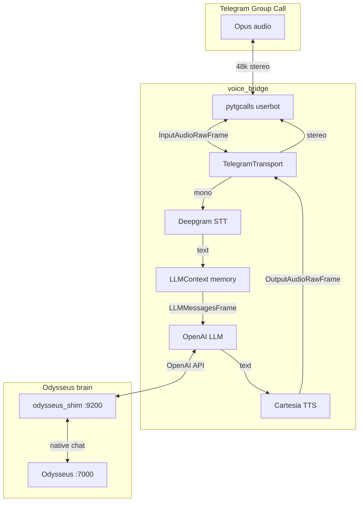

# 🎙️ Odysseus TG Voice

Realtime AI voice host for **Telegram group video chats**.
Joins a call as a userbot, listens to participants, thinks via the **Odysseus** brain,
and replies with a natural Russian voice.

## ✨ What it does

- Joins Telegram group calls via `pytgcalls` userbot.
- Streams participant audio into a **pipecat-ai** pipeline.
- Transcribes speech with **Deepgram** (nova-3, Russian).
- Reasons and keeps context with the **Odysseus** brain.
- Speaks back with **Cartesia** TTS (sonic-3.5, Russian female voice, dynamic emotion).

## 🏗️ Architecture



[Open interactive architecture diagram →](docs/architecture.html)

## 🚀 Quick start

### Requirements
- Docker + docker compose.
- A separate Telegram account for the userbot.
- API keys: Telegram, Deepgram, Cartesia, OpenModel.
- Optional SOCKS5 proxy (Telegram may be blocked in some regions).

### 1. Configure
```bash
cp .env.example .env
# edit .env with your keys
```

### 2. Start the brain stack
```bash
docker compose up -d --build anthropic_proxy chromadb odysseus odysseus_shim
./tools/test_brain.sh shim
```

### 3. Authorize the Telegram userbot
```bash
source .venv/bin/activate
set -a && source .env && set +a
export SESSIONS_DIR="$(pwd)/voice_bridge/sessions"
python tools/tg_setup.py login
```

### 4. Start voice_bridge
```bash
./tools/run_local.sh
# or with docker:
# docker compose up -d voice_bridge && docker compose logs -f voice_bridge
```

### 5. Control the bot
Send a DM to the userbot account:

| Command | Action |
|---------|--------|
| `/odysseus call` | Join/create call in the default group |
| `/odysseus join [chat_id]` | Join an active call |
| `/odysseus leave [chat_id]` | Leave |
| `/odysseus say <text>` | Speak a phrase |
| `/odysseus reset` | Clear chat memory |
| `/odysseus groups` | List groups |
| `/odysseus help` | All commands |

## ⚙️ Configuration

All settings live in `.env` (see `.env.example`).

| Variable | Meaning |
|----------|---------|
| `TG_API_ID`, `TG_API_HASH` | Telegram app credentials (https://my.telegram.org) |
| `TG_OWNER_ID`, `TG_OWNER_USERNAME` | Who can control the bot via DM |
| `TG_TEST_GROUP_ID` | Default group for calls |
| `DEEPGRAM_API_KEYS` | Comma-separated Deepgram keys (rotation) |
| `CARTESIA_API_KEYS` | Comma-separated Cartesia keys (rotation) |
| `CARTESIA_VOICE_ID`, `CARTESIA_MODEL_ID` | Voice and model for TTS |
| `BRAIN_URL`, `BRAIN_API_KEY`, `BRAIN_MODEL` | OpenAI-compatible brain endpoint |
| `PROXY_URL`, `TG_PROXY_KIND` | SOCKS5/HTTP proxy for Telegram |

The bot persona is in `prompts/persona_odysseus.txt` (editable without rebuild).

## 🧠 Audio pipeline


- **Dynamic emotions:** TTS emotion is picked from the text (happy, sad, curious, surprised, annoyed).
- **Key rotation:** Deepgram and Cartesia keys rotate round-robin for resilience.
- **Interruptions:** the pipeline supports barge-in (clear queued TTS on new user speech).

## 🛡️ Safety notes

- Use a dedicated Telegram account for the userbot.
- Never commit `.env`, `*.session`, or session files.
- Internal services bind to `127.0.0.1` only.

## 📜 Credits

Built with [pipecat-ai](https://github.com/pipecat-ai/pipecat), [pytgcalls](https://github.com/pytgcalls/pytgcalls),
[Deepgram](https://deepgram.com), [Cartesia](https://cartesia.ai), and [Odysseus](https://github.com/pewdiepie-archdaemon/odysseus).
